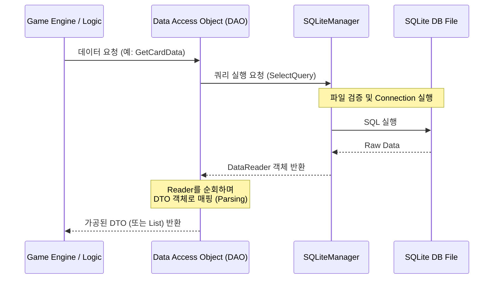
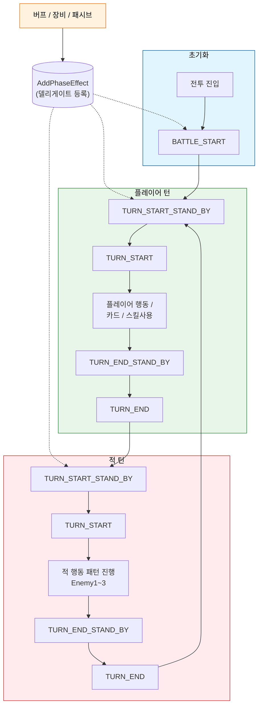
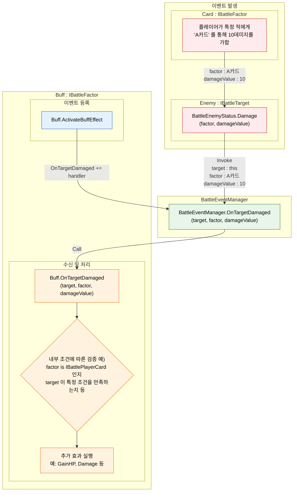
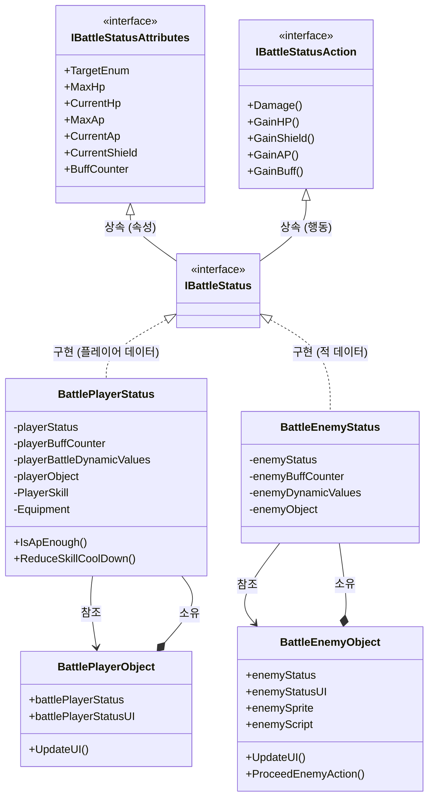

# 샴블즈 (Shambles)

<p align="center">
  <a href="https://www.youtube.com/watch?v=nS2DFa193OY">
    
  </a>
</p>

<p align="center">
  <a href="https://store.steampowered.com/app/2289630/_/?l=koreana"></a>&nbsp;&nbsp;&nbsp;
  <a href="https://play.google.com/store/apps/details?id=com.gravity.shambles.aos"></a>&nbsp;&nbsp;&nbsp;
  <a href="https://apps.apple.com/kr/app/%EC%83%B4%EB%B8%94%EC%A6%88-%EC%A2%85%EB%A7%90%EC%9D%98-%ED%9B%84%EC%86%90%EB%93%A4/id6740197039"></a>
</p>


## 개요

포스트 아포칼립스 세계관을 배경으로 한 2D 텍스트 RPG, 덱빌딩, 로그라이크 게임입니다.

*   **장르**: 텍스트 RPG, 덱빌딩, 로그라이크
*   **개발 기간**: 2년
*   **출시일**: 2025.03.27 (Mobile) / 2025.06.26 (PC)
*   **참여 인원**: 기획 2명, 아트 4명, 프로그래밍 3명
*   **역할**: 리드 프로그래머

## 기술 스택

[](https://unity.com/) [](https://dotnet.microsoft.com/ko-kr/languages/csharp) [](https://dotnet.microsoft.com/) [](https://www.sqlite.org/) [](https://aws.amazon.com/s3/)

[](https://visualstudio.microsoft.com/) [](https://code.visualstudio.com/)


## 기술 특징

* [1. 데이터베이스](#1-데이터베이스)
    * [1.1. DataReader](#1-1-datareader)
    * [1.2. Data Transfer Object (DTO)](#1-2-data-transfer-object-dto)
    * [1.3. Data Access Object (DAO)](#1-3-data-access-object-dao)
* [2. 전투 시스템](#2-전투-시스템)
    * [2.1. BattleManager](#2-1-battlemanager)
    * [2.2. BattlePhaseManager](#2-2-battlephasemanager)
    * [2.3. BattleEventManager](#2-3-battleeventmanager)
    * [2.4. BattleEnemyManager](#2-4-battleenemymanager)
    * [2.5. 스테이터스 시스템](#2-5-스테이터스-시스템)
    * [2.6. 전투 로직](#2-6-전투-로직)
    * [2.7. 버프 관리 시스템](#2-7-버프-관리-시스템)
* [3. UI](#3-ui)
    * [3.1. 폰트](#3-1-폰트)
    * [3.2. 텍스트 데이터](#3-2-텍스트-데이터)
    * [3.3. 팝업 관리](#3-3-팝업-관리)
* [4. 매니저](#4-매니저)
    * [4.1. JSON 관리](#4-1-json-관리)
    * [4.2. 클라우드 저장](#4-2-클라우드-저장)
    * [4.3. 업적 시스템](#4-3-업적-시스템)
    * [4.4. 데이터 분석](#4-4-데이터-분석)
    * [4.5. 로딩 시퀀스](#4-5-로딩-시퀀스)
* [5. 개발 환경](#5-개발-환경)
    * [5.1. Excel 워크플로우](#5-1-excel-워크플로우)
    * [5.2. 외부 도구](#5-2-외부-도구)
    * [5.3. 에디터 확장](#5-3-에디터-확장)


## 1. 데이터베이스

메인 게임 데이터 관리에는 **SQLite**를 사용합니다. 데이터베이스 시스템은 세 가지 핵심 컴포넌트로 구성됩니다:
- **DataReader**: `SqliteDataReader`를 래핑하여 타입 안전 변환, Enum 자동 매칭, 리소스 자동 관리 기능 제공
- **DTO**: 메인 데이터 DTO와 최적화된 DTO로 이원화하여 초기 로딩과 런타임 성능을 모두 확보
- **DAO**: 테이블별 전용 클래스로 쿼리 로직을 캡슐화하고, Boxing/Unboxing 오버헤드 최소화

> 초기 개발 단계에서는 JSON과 유니티 Prefab을 이용해 데이터를 관리했으나, **텍스트 RPG** 장르 특성상 다국어 지원이 추가됨에 따라 데이터 분량이 기하급수적으로 증가했고, 이로 인해 로딩 지연과 데이터 관리의 어려움이 발생했습니다.
>
> 이를 해결하기 위해 서버 없이 로컬 파일만으로 기존 시스템을 수행할 수 있는 여러 대안을 찾던 중 SQLite를 선택했습니다. 기존 데이터 구조를 바탕으로 ERD를 작성 후 데이터의 성격과 생명주기에 따라 데이터 타입을 분류한 뒤, 게임 중에는 수정되지 않는 정적 데이터로 이루어진 **Game Data**, 매 플레이마다 초기화되는 **Player Data**, 그리고 플레이 내내 누적되는 **User Data**의 3가지 데이터베이스 파일을 생성하여 관리하도록 구현했습니다.

아래 시퀀스 다이어그램은 게임 로직에서 데이터를 요청할 때의 흐름을 나타냅니다. DAO가 쿼리를 작성하여 SQLiteManager에 전달하고, 반환된 DataReader로 원시 데이터를 파싱하여 DTO 객체로 변환합니다.



### 1.1. DataReader

DataReader에는 SQLite 데이터베이스와의 통신 및 텍스트 데이터 처리를 담당하는 클래스들이 포함됩니다. DB 연결과 쿼리 실행의 엔드포인트 역할을 하는 `SQLiteManager`, 조회 결과를 안전하게 읽는 `DataReader` 래퍼, 그리고 게임 내 텍스트에 포함된 태그를 파싱하여 동적 수치 변환 및 애니메이션 효과를 적용하는 `TextParser`로 구성되어 있습니다.

#### 1.1.1. SQLiteManager

데이터 파일 관리와 DB 연결을 담당합니다. 게임 데이터, 플레이어 데이터, 유저 데이터 총 3개의 DB 파일을 관리하며, 각 DB에 대한 연결을 배열로 유지합니다. 연결이 닫혀있으면 자동으로 열고, DB 파일이 존재하지 않으면 StreamingAssets에서 복사하여 생성합니다. 씬이 언로드될 때 열려있는 모든 데이터 리더를 자동으로 종료하여 리소스 누수를 방지합니다. `IDisposable` 인터페이스를 구현하여 메모리 할당이 해제될시 자동으로 DB 연결을 해제합니다. DB 파일에서 읽어온 데이터를 SQL 쿼리를 실행하고 결과를 순회할 수 있는 `DataReader` 객체로 반환합니다. 오류 발생 시 에러 처리 후 복구를 시도합니다.

<details>
<summary>SQLiteManager 사용 예제</summary>

<br>

> 다음은 게임 내에서 데이터베이스에 접속하여 데이터를 읽어오는 예입니다. `CardDao`의 `GetCard` 메소드에서 쿼리문을 작성하고 `SQLiteManager.SelectQuery`를 호출하여 `CustomDataReader`를 반환받습니다. 반환된 리더의 `GetSafeValue`를 통해 각 컬럼 값을 타입 안전하게 변환하여 `Card` DTO 객체를 생성합니다. `Illust`와 같이 단일 DAO로 완성되지 않는 데이터는 `IllustrationDao` 등 다른 DAO를 호출하여 복합 데이터를 조합하기도 합니다.

<br>

- [CardDao.cs](https://github.com/ysh4267/Yangjihoon_portfolio/blob/main/001_Shambles/001_Script/001_DataClass/DAO/Card/CardDao.cs)

```csharp
public class CardDao : CollectionDao {
    // UI 출력 용도의 카드 객체를 반환
    public static Card GetCard(int cardIndex, bool isFixed = false) {
        string query =
            $"SELECT ... FROM {DataBaseTableDefine.CardTable} " +
            $"LEFT JOIN {DataBaseTableDefine.CardNameTable} " +
            $"ON {DataBaseTableDefine.CardTable}.card_index = {DataBaseTableDefine.CardNameTable}.card_index " +
            $"WHERE {DataBaseTableDefine.CardTable}.card_index = {cardIndex}";

        CustomDataReader it = SQLiteManager.SelectQuery(query);  // 쿼리 실행

        if (false == it.Read()) {
            return GetCard(620);  // 기본값 카드 반환
        }

        Card card = new Card();
        card.Index = it.GetSafeValue<int>(0);            // 타입 안전 변환
        card.cost = it.GetSafeValue<int>(1);
        card.Illust = IllustrationDao.GetIllust(it.GetSafeValue<int>(2));  // 다른 DAO 호출
        card.Name = it.GetSafeValue<string>(5);
        card.cardFactionEnum = (ENUM_FACTION)it.GetSafeValue<int>(7);
        card.Rarity = it.GetEnumFromString<ENUM_RARITY>(12, ENUM_RARITY.COMMON);  // Enum 변환
        // ...
        return card;
    }
}
```
<br>

> 위에서 호출된 `SQLiteManager`의 메소드인 `SelectQuery`는 `ENUM_DATABASE_PATH` 매개변수로 어떤 데이터베이스에서 읽을지 지정하며, 쿼리 실행 시마다 `OpenConnection`으로 커넥션을 엽니다. `IDisposable`을 구현하여 매니저가 소멸될 때 열려 있는 모든 커넥션을 닫고 리소스를 해제합니다.

<br>

- [SQLiteManager.cs](https://github.com/ysh4267/Yangjihoon_portfolio/blob/main/001_Shambles/001_Script/002_DataReader/SQLiteManager.cs)

<br>

```csharp
public class SQLiteManager : IDisposable {
    // SQL 쿼리를 실행하여 결과 리더를 반환
    public static CustomDataReader SelectQuery(string query, ENUM_DATABASE_PATH enumDataBasePath = ENUM_DATABASE_PATH.GAME_DATA) {
        if (query == null) return null;

        try {
            OpenConnection(enumDataBasePath);  // 연결이 닫혀있으면 열기
            using (SqliteCommand cmd = new SqliteCommand(query, connection[(int)enumDataBasePath])) {
                CustomDataReader customReader = new CustomDataReader(cmd.ExecuteReader());
                readerList.Add(customReader);  // 리더 목록에 추가
                return customReader;
            }
        }
        catch (Exception e) {
            // ... (에러 핸들링 및 DB 복구 로직 생략)
            return null;
        }
    }

    // IDisposable - 객체가 소멸될 때 리소스를 해제
    public void Dispose() {
        if (connection != null) {
            for (int i = 0; i < connection.Length; i++) {
                if (connection[i] != null) {
                    connection[i].Close();  // 연결 종료
                    connection[i] = null;
                }
            }
            connection = null;
        }
    }
}
```

</details>

#### 1.1.2. DataReader

Mono.Data.Sqlite 라이브러리에서 제공하는 `SqliteDataReader`를 래핑하여 안전한 데이터 접근과 다양한 타입 변환을 제공합니다. 핵심 메서드인 `GetSafeValue<T>`는 DB 컬럼 값을 제네릭 타입으로 안전하게 변환합니다. 먼저 값이 `DBNull`인지 확인하고, `DBNull`이면 해당 타입의 기본값을 반환합니다. 값이 존재하면 요청된 타입이 `Nullable`인지 검사하여, 일반 타입이면 `Convert.ChangeType`으로 직접 변환하고, `Nullable` 타입이면 `NullableConverter`를 통해 내부 타입으로 변환 후 반환합니다. 이 외에도 문자열을 Enum으로 변환하는 `GetEnumFromString<T>`, CSV 데이터를 파싱하는 `GetTextValueToIntList` 등의 유틸리티 메서드를 제공합니다.

> 초기 구현 시에는 Mono.Data.Sqlite 라이브러리에서 제공하는 기본 클래스인 `SqliteDataReader`를 바로 사용하려 하였으나, `DBNull` 처리, 타입 변환, 리소스 해제 등의 문제가 있어 해당 이슈를 관리하기 위해 이를 감싸는 `DataReader` 래퍼 클래스를 구현했습니다.

<details>
<summary>데이터 타입을 안전하게 변환</summary>

<br>

- [CustomDataReader.cs](https://github.com/ysh4267/Yangjihoon_portfolio/blob/main/001_Shambles/001_Script/002_DataReader/CustomDataReader.cs)

```csharp
public T GetSafeValue<T>(int colIndex) {
    object theValue = dataReader.GetValue(colIndex);
    Type theValueType = typeof(T);
    if (DBNull.Value != theValue) {
        if (false == IsNullableType(theValueType)) {
            return (T)Convert.ChangeType(theValue, theValueType);
        }
        else {
            NullableConverter theNullableConverter = new NullableConverter(theValueType);
            return (T)Convert.ChangeType(theValue, theNullableConverter.UnderlyingType);
        }
    }
    return default;
}
```

</details>

#### 1.1.3. TextParser

게임 내 텍스트 데이터의 동적 변환을 담당합니다. 주요 기능으로는 카드 설명에 포함된 동적 수치 태그(`#damage:`, `#shield:`, `#heal:` 등)를 파싱하여 현재 스탯 정보를 기반으로 실제 수치를 계산하고 색상이 적용된 문자열로 변환하는 기능, 텍스트에 흔들림이나 투명해지는 효과 등의 애니메이션을 적용하기 위한 태그 처리 기능, 각 팩션명에 고유한 폰트 스타일을 적용하기 위한 태그 파싱 기능, 그리고 대화나 UI 텍스트에서 플레이어 이름이 삽입되어야 하는 위치의 태그를 실제 이름으로 치환하는 기능 등의 메소드들을 제공합니다.

 - 수치값이 적용되기 전 텍스트


 - 수치값이 적용된 후 텍스트


<details>
<summary>카드 설명의 수치 태그를 파싱하는 메소드</summary>

<br>

- [TextParser.cs](https://github.com/ysh4267/Yangjihoon_portfolio/blob/main/001_Shambles/001_Script/002_DataReader/TextParser.cs)

```csharp
public static string ParseStatusBasedCardDescriptionText(this string rawText, int[] status, Card card) {
    foreach (var item in textList) {
        if (item.Contains(damageTag) || item.Contains(shieldTag) || item.Contains(healTag)) {
            int baseValue = int.Parse(temp[temp.Length - 1]);
            int calcValue = Mathf.FloorToInt(StatusCalc(item, card.cardFactionEnum, baseValue));
            result += calcValue.ColoredStringValueWithValue(baseValue);
        }
    }
    return result;
}
```

</details>

### 1.2. Data Transfer Object (DTO)

물리적인 DB I/O 발생과 네트워크 환경에 따른 성능 저하를 방지하고자 데이터 객체 구조를 이원화하여 설계했습니다.

> 초기 구현 시에는 메인 데이터 DTO만을 사용하여 구현했습니다. 그러나 `PlayerInfo`를 여러 번 호출하는 상황에서 게임 프레임이 간헐적으로 튀는 현상이 발생했습니다. SQLite의 읽기/쓰기 속도가 문제인가 싶어 Unity Profiler로 모니터링하여 확인해봤으나, 통신 속도는 10만 TPS 이상으로 문제가 없었습니다.
>
> 이후 DB에서 읽어온 데이터를 객체로 변환하는 Boxing/Unboxing 과정을 의심했고, 실제로 해당 부분에서 예상보다 많은 시간이 소요되는 것을 확인했습니다. 이를 해결하기 위해 LEFT JOIN을 활용하여 단일 쿼리로 데이터를 조회하고, Boxing 과정이 필요 없는 기본 타입만으로 구성된 경량화된 DTO를 별도로 설계하여 사용하기 시작했습니다.

* **메인 데이터 DTO**
    * 단일 쿼리로 모델의 모든 속성을 Fetch합니다.
    * 초기 로딩 시 데이터 통신 횟수(Round-trip)를 최소화하여 대량의 데이터를 한 번의 비용으로 수집합니다.
* **최적화된 DTO**
    * 식별자와 실시간 동기화가 필요한 필수 상태값만 포함합니다.
    * 빈번한 업데이트나 대규모 인덱싱 작업 시 발생하는 I/O 부하를 최적화합니다.
* **다형성 기반 인터페이스 설계**
    * 공통 인터페이스를 통해 서로 다른 타입의 DTO들을 일관된 방식으로 처리합니다.
    * 카드, 장비, 버프 등 다양한 게임 오브젝트가 동일한 인터페이스를 상속받아 통합 관리됩니다.
    * 새로운 DTO 타입 추가 시 기존 로직 수정 없이 확장이 가능합니다.

<details>
<summary>DTO 클래스 예제</summary>

<br>

- [Data Classes](https://github.com/ysh4267/Yangjihoon_portfolio/tree/main/001_Shambles/001_Script/001_DataClass/Class)

```csharp
// 메인 데이터 DTO - 여러 DAO를 통해 조합되는 완전한 데이터 객체
public class PlayerInfo {
    public string name;
    public int statHp, statStr, statInt, statDex, gold, level, exp;  // 단순 데이터
    
    // 여러 DAO를 거쳐 클래스 형태로 로드되는 복합 데이터
    public Skill playerSkill;                                    // SkillDao.GetSkill(index)
    public StarterPack starterPack;                              // StarterPackDao.GetStarterPack(index)
    public Portrait portrait;                                    // PortraitDao.GetPortrait(index)
    public Dictionary<ENUM_EQUIPMENT_PART, Equipment> equipmentStatusDict;  // EquipmentDao.GetEquipment(index)
    public List<Card> cardDeckList;                              // CardDao.GetCard(index)
    public List<Area> clearedAreaList;                           // AreaDao.GetArea(index)
    // ...
}

// 최적화된 DTO - 인덱스만 포함하여 경량화
public class PlayerRawInfo {
    public string name;
    public int statHp, statStr, statInt, statDex, gold, level, exp;  // 동일한 단순 데이터
    
    // 클래스 대신 인덱스만 저장하여 I/O 최소화
    public int playerSkillIndex;
    public int? starterPackIndex;
    public int? portraitIndex;
    public int?[] equipedEquipment;                              // 인덱스 배열
    public List<CardLiteDBData> playerDeckIndexList;             // 경량화된 카드 데이터
    public List<int> clearedAreaIndexList;                       // 인덱스만 저장
    // ...
}
```

</details>

<details>
<summary>DTO 인터페이스 예제</summary>

<br>

- [Interfaces](https://github.com/ysh4267/Yangjihoon_portfolio/tree/main/001_Shambles/001_Script/001_DataClass/Interface)

```csharp
// 인덱스 기반 DTO - 모든 DTO의 기본 인터페이스
public interface IIndexableDTO {
    int Index { get; set; }
}

// UI 렌더링용 DTO - 화면 표시에 필요한 데이터 정의
public interface IRenderableData : IIndexableDTO {
    enum ItemType { card, skill, equipment, starterPack, portrait, buff }
    public ItemType datatype { get; set; }
    public Illustration Illust { get; set; }
}

// 카드 인터페이스 - 카드 타입별 분류
public interface ICard : IRenderableData, IRarity {
    public ENUM_CARD_TYPE CardType { get; set; }
}
```

</details>


### 1.3. Data Access Object (DAO)

DAO는 데이터베이스 접근 로직을 캡슐화하여 비즈니스 로직과 데이터 접근을 분리합니다. 각 데이터 모델별로 전용 DAO 클래스를 구성하여 관련 쿼리와 파싱 로직을 집중 관리합니다. 특히 C#의 Boxing/Unboxing 과정에서 발생하는 성능 부하를 최소화하기 위해, 데이터 변환 로직을 쿼리 단계에서 처리하도록 DAO를 전문화하여 런타임 오버헤드를 줄였습니다.

* **테이블명 상수화**: 테이블 이름은 `TableDefine` Enum으로 정의하여 오타를 방지하고 일관성을 유지합니다.
* **다양한 쿼리 메소드**: 단일 조회, 전체 조회, 조건별 필터링 등 상황에 맞는 최적의 쿼리 메소드를 제공합니다.
* **리소스 관리**: `DataReader`는 `using` 문 내에서 호출하여 사용 후 자동으로 리소스를 해제합니다.
* **쿼리 최적화**: LEFT JOIN을 활용하여 관련 데이터를 단일 쿼리로 조회하고, 불필요한 Round-trip을 최소화합니다.

<details>
<summary>DAO 클래스 예제</summary>

<br>

- [DAO Classes](https://github.com/ysh4267/Yangjihoon_portfolio/tree/main/001_Shambles/001_Script/001_DataClass/DAO)

```csharp
public class CardDao : CollectionDao {
    // 단일 카드 조회 - LEFT JOIN으로 여러 테이블 결합
    public static Card GetCard(int cardIndex) {
        string query =
            $"SELECT ... FROM {DataBaseTableDefine.CardTable} " +
            $"LEFT JOIN {DataBaseTableDefine.CardNameTable} " +
            $"ON {DataBaseTableDefine.CardTable}.card_index = {DataBaseTableDefine.CardNameTable}.card_index " +
            $"LEFT JOIN {DataBaseTableDefine.CardTypeTable} ... " +
            $"WHERE {DataBaseTableDefine.CardTable}.card_index = {cardIndex}";
        
        DataReader it = SQLiteManager.SelectQuery(query);  // 쿼리 실행
        Card card = new Card();
        card.Illust = IllustrationDao.GetIllust(it.GetSafeValue<int>(2));  // 다른 DAO 호출
        // ...
        return card;
    }
    
    // 전투용 카드 조회 - 기본 카드 데이터에 스크립트 추가
    public static Card GetBattleCard(int cardIndex) {
        Card card = GetCard(cardIndex);  // 기본 카드 데이터 재사용
        card.battleCardScript = (IBattlePlayerCard)Activator.CreateInstance(...);  // 동적 인스턴스 생성
        return card;
    }
    
    // 해금된 카드 조회 - 유저 DB에서 인덱스 조회 후 GetCard() 호출
    public static List<Card> GetUnlockedCardList() {
        string query = $"SELECT card_index FROM {DataBaseTableDefine.UnlockedCardTable} " +
                       $"WHERE is_unlocked = 'true'";
        DataReader it = SQLiteManager.SelectQuery(query, ENUM_DATABASE_PATH.USER_DATA);  // 유저 DB 조회
        // 각 인덱스로 GetCard() 호출하여 카드 객체 생성
    }
    
    // 카드 타입 텍스트 조회 - 단일 테이블 조회
    public static string GetCardTypeText(ENUM_CARD_TYPE cardType) { ... }
}
```

</details>


## 2. 전투 시스템

전투 시스템은 싱글톤 패턴의 `BattleManager`를 중심으로 설계되었습니다. 카드, 버프, 장비, 적 등 전투에 참여하는 모든 오브젝트는 다형성 기반의 인터페이스를 상속받아 캡슐화되어 있지만, 실제 효과 발동과 상호작용은 대부분 매니저를 통해 수행됩니다. 이는 오브젝트 간 직접 참조를 방지하고, 새로운 오브젝트 추가 시 기존 로직 수정 없이 확장할 수 있도록 설계한 것입니다. 전투 시작 시 플레이어 고유 시드값으로 랜덤 상태를 초기화하여, 동일한 행동 시퀀스가 항상 동일한 결과를 보장합니다.

아래는 전투 시스템의 핵심 로직을 담당하는 4개의 특징적인 매니저 클래스에 대한 설명입니다.


### 2.1. BattleManager

전투 시스템의 핵심 싱글톤 매니저 클래스입니다. 전투 진행에 필요한 모든 서브 매니저와 UI 컴포넌트를 통합 관리하며, `Start` 메서드에서 각 서브 매니저와 구성 요소를 순차적으로 초기화하는 워터폴 방식을 채택하여 매니저 간의 의존성 문제를 해결하고 초기화 순서를 보장했습니다.

* **서브 매니저 통합**: `BattlePhaseManager`, `BattleEnemyManager`, `BattleEventManager`, `BattleCardManager` 등 모든 전투 관련 매니저를 소유
* **전투 상태 관리**: 전투 시작/종료 조건 확인, 승리/패배 처리
* **UI 매니저**: 플레이어 상태 UI, 적 배치, 오브젝트 풀, 스킬 입력 시스템, 설명 팝업, 대화창, 전투 연출 등
* **업적 시스템 연동**: 전투 시작/종료 시 다양한 조건의 업적 달성 여부를 자동으로 체크

<details>
<summary>BattleManager 클래스</summary>

<br>

- [BattleManager.cs](https://github.com/ysh4267/Yangjihoon_portfolio/blob/main/001_Shambles/001_Script/005_Battle/Manager/BattleManager.cs)

```csharp
public class BattleManager : MonoBehaviour, IDisposable {
    // 전투 진행 핵심 매니저 클래스
    [SerializeField] public BattlePhaseManager battlePhaseManager = null;   // 페이즈 흐름 제어
    [SerializeField] public BattlePlayerObject battlePlayerObject = null;   // 플레이어 객체
    [SerializeField] public BattleEnemyManager battleEnemyManager = null;   // 적 관리
    [SerializeField] public BattleEventManager battleEventManager = null;   // 이벤트 델리게이트
    [SerializeField] public BattleCardManager battleCardManager = null;     // 카드 관리
    // ...

    void Start() {
        // ... (전투 데이터 로드 및 랜덤 시드 초기화)

        battlePlayerObject.Initialize();
        battleEnemyManager.InitializeEnemyList(battleData.enemyList);
        battleCardManager.InitializeCardManager();

        // ... (BGM 재생 및 전투 시작 코루틴 실행)
    }
}
```

</details>

### 2.2. BattlePhaseManager

전투 페이즈 흐름과 턴 사이클을 제어하는 매니저 클래스입니다. 옵저버 패턴을 기반으로 설계되어, 턴 시작/종료, 전투 시작/종료 시점뿐만 아니라 카드 사용, 공격, 데미지, 추가 효과 등 특정 행위 시점에 따른 페이즈 이벤트를 관리하며, 등록된 델리게이트를 실행하고 콜렉터를 관리합니다.

* **페이즈 델리게이트 시스템**: `IBattlePhaseEffect` 인터페이스를 통해 버프, 장비, 패시브 등이 특정 페이즈에 동작을 등록
* **타겟-액션 조합**: `(ENUM_BATTLE_PHASE_TARGET, ENUM_BATTLE_PHASE_ACTION)` 튜플 키로 등록된 동작 관리
* **일회용 페이즈 동작**: n턴 후 자동 실행 및 제거되는 `DisposablePhaseEffect` 지원
* **페이즈 콜렉터**: 특정 시점 사이에 발생한 이벤트를 수집하여 카운트 기반 로직 구현

아래 플로우차트는 메인 전투 루프의 실행 흐름을 나타냅니다.
전투 진입 시 초기화 과정을 거친 후 플레이어와 적이 각자의 턴 시작/행동/종료 단계로 세분화된 페이즈 이벤트를 진행하게 됩니다. 이때 게임중 버프 및 장비 가 `AddPhaseEffect`를 통해 각 대상의 특정 페이즈에 등록한 효과 를 순차적으로 실행합니다.
게임 중에는 턴 사이클 관리 로직이 턴 전환을 지속적으로 체크하며 주요 턴 사이클은 `턴 종료 버튼`을 기준으로 분할되어 전투 흐름을 제어합니다.



<details>
<summary>전투중 페이즈를 이용한 사이클 흐름</summary>

<br>

>아래는 전투 사이클이 직접적으로 관리되는 `ProceedPhase` 메소드입니다. 정의된 순서대로 페이즈를 실행하며, 각 단계가 완료된 후 다음 단계의 `ProceedPhase`를 재귀적으로 호출하여 `TURN_START_STAND_BY` -> `TURN_START` -> (행동) -> `TURN_END_STAND_BY` -> `TURN_END` 순으로 순환하며 게임 흐름을 제어합니다.

- [BattlePhaseManager.cs](https://github.com/ysh4267/Yangjihoon_portfolio/blob/main/001_Shambles/001_Script/005_Battle/Manager/BattlePhaseManager.cs)

```csharp
// 지정된 타겟과 액션에 대한 페이즈 진행
public void ProceedPhase(in ENUM_BATTLE_PHASE_TARGET phaseEnumTargets, ENUM_BATTLE_PHASE_ACTION phaseEnumAction) {
    // ...
    ProceedTargetAction(phaseEnumTargets, (target) => {
        // ...
        // Call Effect Phases (등록된 페이즈 이펙트 실행)
        for (int i = 0; i < count; i++) {
            // ...
            phaseEffectList[(target, phaseEnumAction)][i]?.OnEffectPhase(phaseEnumAction);
        }
        // ...

        // Turn Phases Cycle
        if (phaseEnumAction == BATTLE_START) {
            // 전투 진입
            ProceedPhase(PLAYER, TURN_START_STAND_BY);
        }
        else if (phaseEnumAction == TURN_START_STAND_BY) {
            // 턴 시작 대기: 턴 시작 전 우선 처리될 델리게이트 실행
            BattleManager.GetInstance().SetCurrentTurn(target);
            BattleManager.GetInstance().battleEventManager.OnTurnStart?.Invoke();
            ProceedPhase(target, TURN_START);
        }
        else if (phaseEnumAction == TURN_START) {
            // 턴 시작: 게임 로직상 필요한 핵심 처리 수행
        }
        else if (phaseEnumAction == TURN_END_STAND_BY) {
            // 턴 종료 대기: 턴 종료 전 우선 처리될 델리게이트 실행
            ProceedPhase(target, TURN_END);
        }
        else if (phaseEnumAction == TURN_END) {
            // 턴 종료: 게임 로직상 필요한 핵심 처리 수행 (적 행동 개시 등)
            if (target == PLAYER) {
                BattleManager.GetInstance().battleEnemyManager.ProceedEnemyPattern(ENEMY1);
            }
        }
        // ...
    });
}
```

>버프의 효과 실행 타이밍 또한 페이즈 매니저를 통해 관리됩니다. 버프 획득 시 `ActivateBuffEffect`에서 `AddPhaseEffect`를 호출하여 특정 페이즈(`TURN_START`)에 동작을 등록하고, 버프 종료 시 `EndBuffEffect`에서 `RemovePhaseEffectRequest`로 해제합니다.

- [ExampleBuff.cs](https://github.com/ysh4267/Yangjihoon_portfolio/blob/main/001_Shambles/001_Script/003_Object/Class/Buff/ExampleBuff.cs)

```csharp
public class ExampleBuff : IBattleBuff {
    // 버프 활성화 시 동작 (등록)
    public void ActivateBuffEffect() {
        // 턴 시작 시(TURN_START)에 실행될 효과를 페이즈 매니저에 등록
        BattleManager.GetInstance().battlePhaseManager.AddPhaseEffect(this, BuffTargetStatus.TargetEnum, ENUM_BATTLE_PHASE_ACTION.TURN_START);
    }

    // 버프 종료 시 동작 (해제)
    public void EndBuffEffect() {
        // 등록된 페이즈 이펙트 해제 요청
        BattleManager.GetInstance().battlePhaseManager.RemovePhaseEffectRequest(this, BuffTargetStatus.TargetEnum, ENUM_BATTLE_PHASE_ACTION.TURN_START);
    }
}
```

</details>

### 2.3. BattleEventManager

전투 중 발생하는 이벤트 델리게이트들을 관리하는 클래스입니다. 옵저버 패턴을 통해 버프, 장비, 업적 등이 전투 이벤트를 구독하여 느슨한 결합을 유지합니다. 페이즈 매니저의 이벤트와 달리 `OnTargetDamaged(IBattleStatus target, IBattleFactor factor, int damage)`처럼 효과의 적용 대상(`IBattleStatus`)과 효과의 주체(`IBattleFactor`)를 인자로 직접 전달하기 때문에, 구독자 측에서 별도의 참조 없이도 누가 누구에게 어떤 효과를 발생시켰는지를 동적으로 활용할 수 있습니다.

* **턴 이벤트**: `OnTurnStart`, `OnUseCard`, `OnDrawCard` 등
* **피해/회복 이벤트**: `OnTargetDamaged`, `OnTargetGainHp`, `OnTargetGainShield` 등
* **버프 이벤트**: `OnTargetGainBuff`, `OnTargetLoseBuff`
* **수치 수정 함수**: `DamageAddition`, `CostSet` 등 Func 델리게이트로 동적 수치 계산

> 초기 구현 단계에서는 `BattlePhaseManager`를 활용한 옵저버 패턴만으로 전투 이벤트를 관리하려 했으나, 효과 발동 시점마다 실행 주체와 적용 대상의 데이터를 별도로 참조해야 하는 구조적 번거로움과, 효과의 처리 요청 시점과 처리 시작 시점 간의 상태 참조 불일치 문제가 있었습니다. 이를 보완하기 위해 `BattleEventManager`를 추가하여, 이벤트 실행 시 타겟(`IBattleStatus`)과 요인(`IBattleFactor`) 등 필요한 데이터를 인자로 직접 전달함으로써 복잡한 참조 로직을 간소화하고 특정 순간의 수치 계산시 해당 값에 대한 참조 불일치 문제를 해결하였습니다.

아래는 버프가 이벤트를 구독한 뒤, 전투 중 데미지가 발생했을 때 이벤트가 전파되는 과정입니다. `BattleEnemyStatus`에서 피해가 확정되면 `BattleEventManager`의 델리게이트를 호출하고, 구독 중인 버프가 인자로 전달받은 타겟과 요인 정보를 활용하여 추가 로직을 실행합니다.



<details>
<summary>이벤트 델리게이터 로직 스크립트</summary>


`BattleEventManager`는 다양한 전투 상황에 대응하는 델리게이트를 정의하고 관리합니다.

- [BattleEventManager.cs](https://github.com/ysh4267/Yangjihoon_portfolio/blob/main/001_Shambles/001_Script/005_Battle/Manager/BattleEventManager.cs)

```csharp
public class BattleEventManager : MonoBehaviour {
    // 턴/카드 이벤트
    public Action OnTurnStart;                              // 턴 시작 시 호출
    public Action<Card> OnUseCard = null;                   // 카드 사용 시 호출
    
    // 수치 수정 Func 델리게이트
    public Func<IBattlePlayerCard, int> DamageAddition = null;   // 추가 피해량 계산
    public Func<IBattlePlayerCard, int> CostSet = null;          // 코스트 수정
    
    // 타겟 기반 이벤트
    public Action<IBattleStatus, IBattleFactor, int> OnTargetDamaged = null;      // 피해 발생 시
    public Action<IBattleStatus, IBattleFactor, int> OnTargetGainShield = null;   // 실드 획득 시
}
```


`BattleEnemyStatus` 클래스에서 데미지나 실드 변화 발생 시 `BattleEventManager`를 통해 이벤트를 호출합니다. `IBattleStatus`(타겟)와 `IBattleFactor`(요인)를 인자로 전달하여 구독자들이 상세 정보를 참조할 수 있도록 합니다.

- [BattleEnemyStatus.cs](https://github.com/ysh4267/Yangjihoon_portfolio/blob/main/001_Shambles/001_Script/005_Battle/Status/BattleEnemyStatus.cs)

```csharp
public class BattleEnemyStatus : IBattleStatus {
    public int Damage(IBattleFactor factor, BattleDamage amount) {
        // ... (데미지 계산 및 적용 로직)

        if (finalDamage.damageSourceType == ENUM_DAMAGE_SOURCE_TYPE.DIRECT_ATTACK && factor != null) {
            // 피격 이벤트 호출 - 타겟(this), 요인(factor), 최종 데미지 전달
            BattleManager.GetInstance().battleEventManager.OnTargetDamaged?.Invoke(this, factor, finalDamage.damage);
        }
        // ...
    }

    public void GainShield(IBattleFactor factor, int amount) {
        // ... (실드 계산 로직)

        if (factor != null) {
            // 실드 획득 이벤트 호출 - 타겟(this), 요인(factor), 변화량 전달
            BattleManager.GetInstance().battleEventManager.OnTargetGainShield?.Invoke(this, factor, change);
        }
        // ...
    }
}
```


버프나 아이템 클래스에서 특정 이벤트(`OnTargetDamaged`)를 구독하고, 효과가 종료될 때 구독을 해제합니다.

```csharp
public class ExampleBuff : IBattleBuff {
    // 버프 활성화 시 이벤트 구독
    public void ActivateBuffEffect() {
        BattleManager.GetInstance().battleEventManager.OnTargetDamaged += OnTargetDamaged;
    }

    // 버프 종료 시 구독 해제
    public void EndBuffEffect() {
        BattleManager.GetInstance().battleEventManager.OnTargetDamaged -= OnTargetDamaged;
    }

    // 이벤트 핸들러
    void OnTargetDamaged(IBattleStatus target, IBattleFactor factor, int damage) {
        // (예시) 특정 진영의 카드로 데미지를 받았을 때 추가 로직 실행
        if (factor is IBattlePlayerCard card && card.FactionEnum == ENUM_FACTION.EXAMPLE_FACTION) {
            // ...
        }
    }
}
```

</details>


### 2.4. BattleEnemyManager

전투 중 적 개체들의 생명주기와 행동을 총괄하는 매니저 클래스입니다. 최대 3마리까지의 적 오브젝트를 리스트로 관리하며, 적 생성/사망, 턴 진행, 타겟팅, UI 갱신 등을 담당합니다. Enum 비트 연산을 활용한 복합 타겟팅 시스템으로 단일 메서드 호출로 여러 대상에게 효과를 적용합니다.

* **조건부 적 탐색**: 특정 인덱스나 조건을 만족하는 적들을 비트 플래그로 반환하는 메소드를 제공하여, 복잡한 타겟팅 로직을 비트 연산으로 단순화하여 처리
* **패턴 기반 행동**: 적의 턴마다 `ProceedEnemyPattern`을 통해 순차적으로 행동 실행
* **동적 적 추가/제거**: 전투 중 적 소환, 사망, 교체 처리
* **타겟팅 시스템**: 플레이어 카드 사용 시 타겟 지정 UI 연동

<details>
<summary>BattleEnemyManager 주요 로직</summary>

<br>

`ProceedEnemyPattern`은 적들의 턴을 순차적으로 제어하기 위해 재귀 호출을 사용합니다. `BattleManager.IsBattleEnd`를 체크하여 전투 종료 시 중단하고, 현재 타겟이 `ENEMY3`를 초과하면 플레이어 턴(`TURN_START_STAND_BY`)으로 넘깁니다. 타겟 적이 존재하지 않을 경우 비트 시프트 연산(`(int)current << 1`)을 통해 다음 순번의 적을 즉시 탐색합니다.

```csharp
// 적 턴 진행 로직 (재귀 호출)
public void ProceedEnemyPattern(ENUM_BATTLE_PHASE_TARGET current) {
    if (BattleManager.GetInstance().IsBattleEnd == true) return;  // 전투 종료 시 중단
    if (current > ENEMY3) {  // 마지막 적 이후면 플레이어 턴으로
        BattleManager.GetInstance().battlePhaseManager.ProceedPhase(PLAYER, TURN_START_STAND_BY);
        return;
    }
    var targetEnemy = GetEnemyObject(current);  // 현재 타겟 적 조회
    if (targetEnemy == null) {  // 적이 없으면 다음 슬롯으로 비트 시프트
        ProceedEnemyPattern((ENUM_BATTLE_PHASE_TARGET)((int)current << 1));
        return;
    }
    StartCoroutine(ProceedEnemy(targetEnemy));  // 적 행동 코루틴 실행
}
```

다수의 적에게 일괄적으로 특정 `Action`을 수행하기 위해 `ProceedEnemyAction`은 비트 플래그(`HasFlag`)를 활용합니다. `BattleEnemyObjectList`를 순회하며 입력받은 `enemyTargets` 플래그에 포함된 적(`targetEnemy`)에게만 델리게이트로 전달받은 로직을 실행합니다.

```csharp
// 비트 플래그 기반 델리게이트 일괄 실행
public void ProceedEnemyAction(ENUM_BATTLE_PHASE_TARGET enemyTargets, Action<BattleEnemyObject> action) {
    for (int i = 0; i < BattleEnemyObjectList.Count; i++) {  // 전체 적 리스트 순회
        var targetEnemy = BattleEnemyObjectList[i];
        if (enemyTargets.HasFlag(targetEnemy.enemyPhaseTargetEnum)) {  // 비트 플래그로 타겟 확인
            action(targetEnemy);  // 델리게이트 실행
        }
    }
}
```

- [BattleEnemyManager.cs](https://github.com/ysh4267/Yangjihoon_portfolio/blob/main/001_Shambles/001_Script/005_Battle/Manager/BattleEnemyManager.cs)

</details>


### 2.5. 스테이터스 시스템

전투 중 동적으로 변하는 수치들을 관리하는 시스템입니다. 핵심 인터페이스와 클래스를 통해 플레이어와 적의 상태를 일관되게 처리합니다.

* **IBattleFactor**: 카드, 스킬, 적 행동, 버프 등 `BattleStatus`에 영향을 미치는 모든 요인을 통칭하는 마커 인터페이스입니다. 피해/회복의 원인을 추적하고 효과 발동 시 출처를 명확히 구분합니다.
* **IBattleStatus**: 플레이어와 적의 전투 상태를 정의하는 인터페이스입니다. 속성(Attributes)과 행동(Action)을 분리하여 단일 책임 원칙을 준수합니다.
    * `IBattleStatusAttributes`: HP, AP, 실드, 스탯 배열, 동적 수치, 버프 카운터 등의 속성
    * `IBattleStatusAction`: 피해, 회복, 실드 획득, 버프 부여 등의 행동 메서드
* **BattleStatus (복합 타겟 시스템)**: 여러 `IBattleStatus` 대상에게 동시에 효과를 적용하기 위한 복합 객체입니다. Enum 플래그 연산을 활용하여 유연한 타겟팅이 가능합니다.
    * Enum 비트 연산으로 다중 타겟 지정 (예: `~ENEMY1 & ALL` 구문은 적1을 제외한 모든 대상을 의미)
    * 단일 메서드 호출로 여러 대상에게 동시에 효과 적용
    * 타겟 추가/제거/교체 동적 관리.
* **BattleDynamicValues**: 전투 중 동적으로 변화하는 상태값들을 관리하는 클래스입니다. 버프/디버프 효과, 키워드 상태, 장비 플래그, 스탯 보정치 등을 포함합니다.
    * 스탯 보정 시스템: 합연산(`statusAddition`), 곱연산(`statusMultiply`), 최종값(`statusFinal`) 분리
    * 이벤트 기반 UI 갱신: 스탯 변경 시 자동으로 `STAT_CHANGED` 이벤트 발생
    * 상태 플래그 관리: 관통, 경화, 은신, 무적, 기절 등 다양한 상태 효과
* **BattleDamage**: 피해 정보를 캡슐화하는 데이터 클래스입니다. 연산자 오버로딩을 통해 피해량 계산을 직관적으로 처리합니다.

아래 클래스 다이어그램은 스테이터스 시스템의 구조와 클래스 간 관계를 나타냅니다. **BattlePlayerStatus**와 **BattleEnemyStatus**는 동일한 인터페이스를 구현하여 공통 로직을 공유하지만, 각자의 역할에 따라 고유한 속성과 메서드를 보유합니다.

**BattlePlayerStatus**는 **BattleEnemyStatus**에 비해 스킬, 장비 등의 추가 시스템을 관리하므로 PlayerSkill, Equipment 등의 속성을 보유하며, AP 소모 여부 확인, 스킬 쿨다운 관리 등의 기능을 제공합니다. **BattleEnemyObject**도 **BattlePlayerObject**에 비해 적 스프라이트 애니메이션, 행동 패턴 스크립트, AI 로직 등 더 다양한 요소를 포함하여 복잡한 구조를 가지며, enemyScript, enemySprite 등을 통해 적의 시각적 표현과 행동을 제어합니다.



<details>
<summary>복합 타겟 시스템 예제</summary>

<br>

- [IBattleStatus.cs](https://github.com/ysh4267/Yangjihoon_portfolio/blob/main/001_Shambles/001_Script/005_Battle/Interface/IBattleStatus.cs)
- [IBattleStatusAttributes.cs](https://github.com/ysh4267/Yangjihoon_portfolio/blob/main/001_Shambles/001_Script/005_Battle/Interface/IBattleStatusAttributes.cs)
- [IBattleStatusAction.cs](https://github.com/ysh4267/Yangjihoon_portfolio/blob/main/001_Shambles/001_Script/005_Battle/Interface/IBattleStatusAction.cs)
- [BattleStatus.cs](https://github.com/ysh4267/Yangjihoon_portfolio/blob/main/001_Shambles/001_Script/005_Battle/Status/BattleStatus.cs)
- [BattlePlayerStatus.cs](https://github.com/ysh4267/Yangjihoon_portfolio/blob/main/001_Shambles/001_Script/005_Battle/Status/BattlePlayerStatus.cs)
- [BattleEnemyStatus.cs](https://github.com/ysh4267/Yangjihoon_portfolio/blob/main/001_Shambles/001_Script/005_Battle/Status/BattleEnemyStatus.cs)
- [BattlePlayerObject.cs](https://github.com/ysh4267/Yangjihoon_portfolio/blob/main/001_Shambles/001_Script/005_Battle/Entity/BattlePlayerObject.cs)
- [BattleEnemyObject.cs](https://github.com/ysh4267/Yangjihoon_portfolio/blob/main/001_Shambles/001_Script/005_Battle/Entity/BattleEnemyObject.cs)
- [ENUM_BATTLE_PHASE_TARGET.cs](https://github.com/ysh4267/Yangjihoon_portfolio/blob/main/001_Shambles/001_Script/006_Enum/ENUM_BATTLE_PHASE_TARGET.cs)

```csharp
[System.Flags]
public enum ENUM_BATTLE_PHASE_TARGET
{
    PLAYER  = 1, // 0b_0000_0001
    ENEMY1  = 2, // 0b_0000_0010
    ENEMY2  = 4, // 0b_0000_0100
    ENEMY3  = 8, // 0b_0000_1000
    ALL_ENEMIES   = ENEMY1 | ENEMY2 | ENEMY3, // 14
    ALL     = PLAYER | ENEMY1 | ENEMY2 | ENEMY3, // 15
    NONE         // 16
}
```

`BattleStatus`는 위의 플래그 Enum을 활용하여 여러 `IBattleStatus`를 하나의 타겟 객체로 묶는 복합 클래스입니다. 생성자에서 전달받은 플래그 값을 `HasFlag`로 검사하여 해당하는 플레이어와 적을 타겟 리스트에 추가하고, `Damage`나 `GainShield` 등의 메소드 호출 시 리스트에 포함된 모든 타겟에 일괄 적용합니다.

```csharp
// 여러 IBattleStatus를 타겟으로 사용하기 위한 복합 객체
public class BattleStatus : IBattleStatusAction {
    private List<IBattleStatus> Targets;
    
    // Enum 플래그 연산으로 다중 타겟 지정
    public BattleStatus(ENUM_BATTLE_PHASE_TARGET target) {
        if (target.HasFlag(playerStatus.TargetEnum)) { Targets.Add(playerStatus); }
        foreach (var enemy in enemyList) {
            if (target.HasFlag(enemy.TargetEnum)) { Targets.Add(enemy); }
        }
    }
    
    // 모든 타겟에 피해 적용
    public int Damage(IBattleFactor factor, BattleDamage amount) {
        ProceedTargetAction((target) => result += target.Damage(factor, amount));
        return result;
    }
}
```

</details>


### 2.6. 전투 로직

전투에서 사용되는 카드, 버프, 장비, 적 등의 오브젝트는 UI에 표시되는 데이터를 가진 상위 객체이며, 각 오브젝트는 실제 기능을 수행하는 **전투 로직 클래스**를 변수로 소유합니다. 이 클래스들은 공통 인터페이스를 상속받아 다형성 기반으로 동작하며, 효과 처리는 `BattleManager`를 통해 일관되게 수행됩니다.

전투 로직 클래스는 DB에 저장된 클래스명(문자열)을 키로 사용하여, DAO에서 `Activator.CreateInstance`를 통해 런타임에 동적으로 인스턴스화됩니다. 이를 통해 새로운 카드나 버프를 추가할 때 코드 수정 없이 DB 데이터만 추가하면 됩니다.

* **카드 (Card)**: 플레이어 카드와 적 카드 모두 `IBattleFactor`를 상속받아 동일한 효과 처리 파이프라인을 사용합니다.
    * `IBattlePlayerCard`: 세력, 코스트, 수치 데이터, 사용 후 목적지, 연계 장비 등
    * `IBattleEnemyCard`: 소유자/타겟 상태, 카드 초기화 및 발동 메서드
    * 적의 공격과 스킬도 동일한 카드 시스템을 기반으로 동작하여 로직 재사용성을 극대화했습니다.
* **버프 (Buff)**: `IBattleBuff` 인터페이스를 통해 모든 버프/디버프를 일관되게 관리합니다.
    * 버프/디버프 유형 구분 (`ENUM_BUFF_TYPE`)
    * 카운터 감소 방식 지정 (`ENUM_BUFF_COUNTER_TYPE`: 턴 종료, 피격 시, 행동 시 등)
    * 활성화/종료 시점 콜백 메서드 제공
    * `IBattleBuffActive`, `IBattleBuffPassive`로 능동/수동 버프 분리
* **장비 (Equipment)**: `IBattleEquipment` 인터페이스를 통해 장비 효과를 관리합니다. 장비 효과 또한 내부적으로는 `Buff` 형태로 생성되어 처리되므로, 적/플레이어의 행동과 유사한 메커니즘을 공유합니다.
* **적 (Enemy)**: `IBattleEnemy`를 통해 행동 패턴을 결정하며, 공격/방어/버프 등의 모든 행위는 `IBattleEnemyCard`를 사용하여 플레이어가 카드를 사용하는 것과 완벽히 동일한 메커니즘으로 처리됩니다. 이를 통해 플레이어와 적의 로직이 일관성 있게 관리되며 자주 반복되는 효과의 구현이 간단해집니다.
    * 패턴 기반 행동 시스템 (공격, 방어, 버프 등) -> `EnemyCard` 사용
    * 플레이어 카드 로직과 동일한 파이프라인 공유
    * 적별 고유 사운드 에셋 관리

<details>
<summary>전투 로직 인터페이스 예제</summary>

<br>

- [Battle Interfaces](https://github.com/ysh4267/Yangjihoon_portfolio/tree/main/001_Shambles/001_Script/005_Battle/Interface)
- [Card.cs](https://github.com/ysh4267/Yangjihoon_portfolio/blob/main/001_Shambles/001_Script/003_Object/Class/Card/PlayerCard/ExamplePlayerCard.cs)
- [Skill.cs](https://github.com/ysh4267/Yangjihoon_portfolio/blob/main/001_Shambles/001_Script/003_Object/Class/Card/SkillCard/ExampleSkillCard.cs)
- [Buff.cs](https://github.com/ysh4267/Yangjihoon_portfolio/blob/main/001_Shambles/001_Script/003_Object/Class/Buff/ExampleBuff.cs)
- [Equipment.cs](https://github.com/ysh4267/Yangjihoon_portfolio/blob/main/001_Shambles/001_Script/003_Object/Class/Equipment/ExampleEquipment.cs)
- [Enemy.cs](https://github.com/ysh4267/Yangjihoon_portfolio/blob/main/001_Shambles/001_Script/003_Object/Class/Enemy/ExampleEnemy.cs)
- [EnemyCards](https://github.com/ysh4267/Yangjihoon_portfolio/tree/main/001_Shambles/001_Script/003_Object/Class/Card/EnemyCard)


```csharp
// DAO에서 클래스명으로 동적 인스턴스 생성
card.battleCardScript = (IBattlePlayerCard)Activator.CreateInstance(Type.GetType(it.GetSafeValue<string>(0)));
enemy.enemyPattern = (IBattleEnemy)Activator.CreateInstance(Type.GetType(it.GetSafeValue<string>(1)));
```

```csharp
// 모든 전투 요인의 최상위 마커 인터페이스. 데미지 계산 및 효과 적용의 주체(Causer)로 추적됨.
public interface IBattleFactor { }

// 플레이어 카드와 적 스킬의 공통 인터페이스. 동일한 파이프라인에서 처리됨.
public interface IBattleCard : IBattleFactor {
    IBattleStatus OwnerStatus { get; set; } // 카드의 소유자 상태
    void ProceedCardAction(IBattleStatus cardTargetStatus = null); // 카드 효과 실행
}

// 플레이어 카드 인터페이스
public interface IBattlePlayerCard : IBattleCard { }

// 적 카드 인터페이스 (불필요한 오버헤드 제거 및 최적화 목적)
public interface IBattleEnemyCard : IBattleCard { }

// 버프 인터페이스. 턴/행동 기반으로 카운팅되며 효과를 발동함.
public interface IBattleBuff : IBattleFactor {
    void ActivateBuffEffect(); // 버프 효과 발동
}
```

</details>

### 2.7. 버프 관리 시스템

캐릭터의 버프와 디버프 상태를 관리하는 `CharacterBuffCounter` 클래스는 플레이어와 적의 전투 상태에 영향을 미치는 모든 버프를 추가, 제거, 조회하는 역할을 수행합니다. 버프 카운트 감소, 면역 판정, UI 갱신 등의 기능을 포함하며, `IBattlePhaseEffect` 인터페이스를 구현하여 페이즈 이벤트에 자동으로 반응합니다.

* **버프 리스트 관리**: 전체 버프, 턴 기반 버프, 카드 버프를 분리 관리하여 각 버프 타입별로 최적화된 처리를 수행합니다.
* **버프 추가 및 중첩**: 동일한 버프가 존재할 경우 카운트를 중첩시키고, 버프 획득 시 페이즈 이벤트를 발동하여 다른 시스템과 연계합니다.
* **카운트 감소 시스템**: 턴 종료 시 턴 기반 버프의 카운트를 자동으로 감소시키며, 카운트가 0에 도달하면 버프를 제거합니다.
* **면역 판정**: 장비나 버프 조건에 따라 특정 디버프에 대한 면역 여부를 판정하는 로직을 제공합니다.
* **안전한 순회**: 버프 리스트를 순회하며 각 버프에 지정된 액션을 실행하되, 순회 중 리스트가 변경되어도 안전하게 동작하도록 설계되었습니다.

<details>
<summary>CharacterBuffCounter 주요 작동 로직</summary>

<br>

- [CharacterBuffCounter.cs](https://github.com/ysh4267/Yangjihoon_portfolio/blob/main/001_Shambles/001_Script/005_Battle/Data/CharacterBuffCounter.cs)

버프를 추가할 때는 먼저 면역 여부를 확인하고, 페이즈 이벤트를 발동한 후 동일한 버프가 이미 존재하면 카운트를 중첩시킵니다. 새로운 버프일 경우 리스트에 추가하며, UI와 사운드를 갱신합니다.

```csharp
public void AddBuff(Buff buff) {
    if (buff.battleBuffScript.ContinuousCount <= 0) return;
    
    // 플레이어일 경우 면역 체크
    if (targetStatus == BattleManager.GetInstance().battlePlayerObject.battlePlayerStatus) {
        if (CheckImmunity(buff)) return;
        
        // 버프/디버프 획득 페이즈 실행
        if (buff.enumBuffType == ENUM_BUFF_TYPE.BUFF)
            BattleManager.GetInstance().battlePhaseManager.ProceedPhase(ENUM_BATTLE_PHASE_TARGET.PLAYER, ENUM_BATTLE_PHASE_ACTION.GAIN_BUFF);
        if (buff.enumBuffType == ENUM_BUFF_TYPE.DEBUFF)
            BattleManager.GetInstance().battlePhaseManager.ProceedPhase(ENUM_BATTLE_PHASE_TARGET.PLAYER, ENUM_BATTLE_PHASE_ACTION.GAIN_DEBUFF);
    }
    
    // 동일 버프 중첩 처리
    bool exist = false;
    foreach (var _buff in allBuffList) {
        if (_buff.battleBuffScript.BuffName == buff.battleBuffScript.BuffName) {
            _buff.battleBuffScript.ContinuousCount += buff.battleBuffScript.ContinuousCount;
            if (_buff.battleBuffScript.ContinuousCount > 9999) _buff.battleBuffScript.ContinuousCount = 9999;
            exist = true;
        }
    }
    
    // 새로운 버프 추가
    if (!exist) {
        allBuffList.AddLast(buff);
        if (buff.battleBuffScript.CounterType == ENUM_BUFF_COUNTER_TYPE.COUNT_BY_TURN)
            countByTurnBuffList.AddLast(buff);
    }
    
    // UI 및 사운드 갱신
    iconList.UpdateBuffList(updateUIDelay);
    targetStatus.UpdateUI();
}
```

버프 리스트를 순회할 때는 각 버프에 액션을 적용하면서, 순회 중 버프가 제거되어 리스트가 변경되더라도 이미 처리된 노드를 추적하여 안전하게 다음 노드로 이동합니다.

```csharp
private void ProceedBuffAction(in LinkedList<Buff> buffList, Action<Buff> action) {
    List<LinkedListNode<Buff>> proceededBuffList = new List<LinkedListNode<Buff>>();
    var node = buffList.First;
    
    while (node != null) {
        try {
            proceededBuffList.Add(node);
            action(node.Value);  // 액션 실행
        }
        catch (System.Exception) {
            return;
        }
        
        // 순회 중 노드가 제거되었는지 확인
        if (!buffList.Contains(node.Value)) {
            // 제거되었다면 처음부터 다시 시작하되, 이미 처리된 노드는 건너뜀
            node = buffList.First;
            while (proceededBuffList.Contains(node)) {
                node = node.Next;
            }
        }
        else {
            node = node.Next;
        }
    }
}
```

</details>


---


## 3. UI

다양한 플랫폼과 해상도 환경에 대응하기 위해, 기기별 UI 프리셋을 런타임에 적용하도록 구현했습니다. 반복적인 UI 작업을 자동화하여 개발 효율과 유지보수성을 확보했습니다.


### 3.1. 폰트

* **프리셋 기반 자동 조정**: `TextMeshPro`를 기반으로 언어와 플랫폼별 텍스트 크기와 폰트 스타일을 관리하는 프리셋 에디터를 사용합니다.
* **환경 대응**: 각 텍스트 오브젝트가 자신의 프리셋 타입을 명시하여, 실행 환경(모바일/PC, 한국어/영어 등)에 맞춰 자동으로 최적의 표시 상태로 조정됩니다.

환경이나 조건별로 폰트 및 사이즈 자동 적용예시

Windows 환경의 경우


Android 환경의 경우


시스템 언어가 영어일 경우


<details>
<summary>폰트 프리셋 및 폰트 사이즈 자동 조정</summary>

<br>

- [FontPresetDefine.cs](https://github.com/ysh4267/Yangjihoon_portfolio/blob/main/001_Shambles/001_Script/004_UI/Font/FontPresetDefine.cs)
- [FontSizeDefine.cs](https://github.com/ysh4267/Yangjihoon_portfolio/blob/main/001_Shambles/001_Script/004_UI/Font/FontSizeDefine.cs)

`FontPresetData`에는 Enum으로 분류된 텍스트 타입을 기준으로 폰트와 사이즈가 언어, 작동 환경별로 지정되어 있습니다. `GetFontPresetData`는 현재 설정된 언어에 맞는 프리셋 데이터를 반환하며, 인덱스 범위를 초과하는 요청이 들어올 경우 기본값(마지막 프리셋)을 반환하여 런타임 에러를 방지합니다.

```csharp
public static FontPresetData GetFontPresetData {
    get {
        if ((int)SettingManager.CurrentLanguage >= FontPreset.Length) {
            // 인덱스 초과 시 기본값 반환
            FontPreset = new FontPresetData[4] { new FontPresetData(0), new FontPresetData(1), new FontPresetData(2), new FontPresetData(3) };
            return FontPreset[FontPreset.Length - 1];
        }
        return FontPreset[(int)SettingManager.CurrentLanguage];
    }
}
```

사용자의 텍스트 크기 설정(Small, Medium, Large)을 확인하여, 그에 대응하는 미리 정의된 폰트 사이즈 객체를 반환합니다.

```csharp
public static FontSize CurrentFontSize {
    get {
        switch (SettingManager.GetSettingData().textSize) {
            case ENUM_TEXT_SIZE.SMALL: return smallFont;
            case ENUM_TEXT_SIZE.MEDIUM: return mediumFont;
            case ENUM_TEXT_SIZE.LARGE: return largeFont;
            default: return mediumFont;
        }
    }
}
```

</details>


### 3.2. 텍스트 데이터

* **JSON-Enum 1:1 매칭**: 모든 게임 내 텍스트 데이터를 JSON 파일로 관리하며, 코드 내 Enum과 1:1로 매칭되어 유지보수성을 확보합니다.
* **자동화된 다국어 처리**: 언어별 JSON 데이터만 변경하면 즉시 게임에 반영되며, 특정 언어 항목 누락 시 기본 언어 값으로 대체되는 페일세이프 기능을 지원합니다.
* **오류 방지**: 키가 존재하지 않는 경우에도 자동으로 빈 문자열을 할당하여 런타임 에러를 방지합니다.

<details>
<summary>텍스트 데이터 지연 로딩 및 페일세이프</summary>

<br>

- [TextDefine.cs](https://github.com/ysh4267/Yangjihoon_portfolio/blob/main/001_Shambles/001_Script/004_UI/Font/TextDefine.cs)
- [TextDefineString.cs](https://github.com/ysh4267/Yangjihoon_portfolio/blob/main/001_Shambles/001_Script/004_UI/Font/TextDefineString.cs)
- [TextDefineStringData.cs](https://github.com/ysh4267/Yangjihoon_portfolio/blob/main/001_Shambles/001_Script/004_UI/Font/TextDefineStringData.cs)

현재 언어 설정에 맞는 텍스트 데이터를 반환합니다. 데이터가 메모리에 없는 경우 실시간으로 로드하여 반환하는 지연 로딩 방식을 사용합니다.

```csharp
public static TextDefineString Current {
    get {
        if (!DefineString.TryGetValue(SettingManager.CurrentLanguage, out var defineString)) {
            defineString = new TextDefineString(SettingManager.CurrentLanguage);
            DefineString.Add(SettingManager.CurrentLanguage, defineString);
        }
        return DefineString[SettingManager.CurrentLanguage];
    }
}
```

기본 언어 데이터를 먼저 로드한 뒤 선택된 언어 데이터를 덮어씌웁니다. 특정 키가 번역본에 누락되었더라도 기본 언어 값이 유지되어 텍스트가 비어 보이는 현상을 방지합니다.

```csharp
public TextDefineString(ENUM_LANGUAGE languageEnum) {
    // 기본 언어(한국어)를 먼저 로드한 뒤, 선택된 언어 데이터로 덮어쓰는 방식을 사용합니다.
    var baseLanguage = ENUM_LANGUAGE.ko_KR;
    JsonDataManager.ReadLanguageData<TextDefineStringData>(baseLanguage, out var baseTextData);
    textData = baseTextData.stringData;
    listTextData = baseTextData.listStringData;

    JsonDataManager.ReadLanguageData<TextDefineStringData>(languageEnum, out var overrideTextData);

    // 데이터 병합 (Override)
    foreach (var item in overrideTextData.stringData) {
        textData[item.Key] = item.Value;
    }
}
```

</details>


### 3.3. 팝업 관리

* **팝업 객체 표준화**: `IPopup` 인터페이스를 상속받아 모든 팝업 객체를 통합 관리하고, `CloseAnimationPopup` 클래스를 통해 종료 시 공통된 DOTween 애니메이션 시퀀스가 실행되도록 구현하였습니다.

> 

<details>
<summary>팝업 스택 자동 관리 및 애니메이션</summary>

<br>

- [IPopup.cs](https://github.com/ysh4267/Yangjihoon_portfolio/blob/main/001_Shambles/001_Script/004_UI/Popup/IPopup.cs)
- [CloseAnimationPopup.cs](https://github.com/ysh4267/Yangjihoon_portfolio/blob/main/001_Shambles/001_Script/004_UI/Popup/CloseAnimationPopup.cs)

팝업 UI의 기반이 되는 클래스로, 팝업이 활성화되는 즉시 `GameManager`의 팝업 스택에 등록되어 '뒤로가기' 키를 통한 순차석 닫기를 지원합니다. 닫기 요청(Close Request) 발생 시 즉시 객체가 사라지지 않고, 지정된 축소 및 페이드 애니메이션을 모두 수행한 뒤에 비활성화 되도록 생명주기를 관리합니다.

```csharp
public class CloseAnimationPopup : MonoBehaviour, IPopup {
    // 닫기 요청 시 애니메이션 실행 후 비활성화 처리
    public virtual void ClosePopupRequest() {
        if (isAnimated == false) {
            ClosePopup();
            return;
        }
        
        // DOTween을 사용하여 스케일 축소 및 배경 페이드아웃 연출
        // 연출 종료 시 콜백(OnComplete)을 통해 오브젝트 비활성화 및 상태 초기화 수행
    }

    // 활성화/비활성화 시 매니저 스택 자동 관리
    protected virtual void OnEnable() {
        GameManager.GetInstance()?.PushPopup(this);
    }
    protected virtual void OnDisable() {
        GameManager.GetInstance()?.PopPopup();
    }
}
```

</details>

---
## 4. 매니저

게임의 핵심 기능을 담당하는 매니저 클래스들은 싱글톤 패턴이나 정적 클래스로 구현되어 전역적인 접근성을 제공하며, 각 기능별로 책임을 명확히 분리했습니다.

### 4.1. JSON 관리

Json 형식으로 게임 데이터를 로컬에 저장하거나 읽어오기 위한 유틸리티 클래스입니다. `Newtonsoft.Json`을 래핑하여 직렬화/역직렬화를 수행하며, 보안이 필요한 데이터에 대해 암호화를 지원합니다.

*   **데이터 무결성 검사**: 파일 로드 시 `CheckIntagrity` 메서드를 통해 클래스의 필드 및 프로퍼티 누락 여부를 검증하여 데이터 오염을 방지합니다.
*   **플랫폼별 파일 처리**: Android(UnityWebRequest)와 PC/iOS(FileStream) 환경에 맞춰 파일 읽기/쓰기 방식을 분기하여 처리합니다.
*   **AES 암호화**: 배포 빌드(`Release`)에서는 데이터 보호를 위해 AES 알고리즘으로 파일을 암호화하여 저장합니다. 디버그 모드에서는 비활성화됩니다.


<details>
<summary>JSON 데이터 읽기 및 무결성 검증</summary>

<br>

- [JsonDataManager.cs](https://github.com/ysh4267/Yangjihoon_portfolio/blob/main/001_Shambles/001_Script/007_Manager/JsonDataManager.cs)

파일로부터 데이터를 읽기 위한 ReadData 메소드는 출력할 데이터 타입을 제네릭 타입 `T`로 받아 파일 입출력을 수행합니다. 파일 시스템에서 JSON 텍스트를 읽어온 후, 암호화 플래그를 확인하여 필요한 경우 AES 복호화를 선행합니다. 이후 `Newtonsoft.Json`을 통해 객체로 역직렬화하고, `CheckIntagrity` 메소드로 데이터 무결성을 검증합니다. 검증 실패 시 `false`를 반환하여 데이터 오염을 알리고 기본 형식의 데이터를 반환합니다.

```csharp
public static bool ReadData<T>(ENUM_JSON_FILE fileType, out T data, bool isIntact = false) where T : new() {
    string jsonData = File.ReadAllText(filePath);
    
    if (fileEncryptionStatus[fileType] == true) {
        jsonData = Decrypt(jsonData, fileNameList[fileType]);
    }

    data = JsonConvert.DeserializeObject<T>(jsonData, settings);

    if (!isIntact && !CheckIntagrity<T>(jsonData)) {
        data = new T();
        return false; 
    }
    return true;
}
```

만약 무결성이 필요한 경우 `CheckIntagrity`를 이용해 검사합니다. `CheckIntagrity`는 `JObject`로 파싱된 JSON 데이터와 리플렉션으로 추출한 타입 `T`의 필드 정보를 대조합니다. 클래스에 정의된 모든 필드가 JSON 데이터 내에 키값으로 존재하는지 순회하며 검사합니다.

```csharp
private static bool CheckIntagrity<T>(string jsonData) where T : new() {
    JObject jsonObj = JObject.Parse(jsonData);
    Type type = typeof(T);

    foreach (var field in type.GetFields(BindingFlags.Public | BindingFlags.NonPublic | BindingFlags.Instance)) {
        if (!jsonObj.TryGetValue(field.Name, StringComparison.OrdinalIgnoreCase, out JToken _)) {
            return false;
        }
    }
    return true;
}
```

</details>

### 4.2. 클라우드 저장

> 출시 전에는 클라우드 저장의 필요성을 느끼지 못했으나, 정식 출시 이후 유저들의 요청에 따라 지원을 결정했습니다. Google Play의 클라우드 저장 기능과 Apple Game Center의 클라우드 저장 기능을 각각 사용하는 방안을 검토했으나, 플랫폼별로 개별 개발하는 것보다 Unity Cloud Save를 활용하는 것이 개발 시간 단축에 유리하다고 판단했습니다.
>
> Unity Cloud Save의 데이터 저장 기능을 이용하여 JSON 형태로 데이터를 가공해 주고받는 로직을 공용으로 사용하되, 각 플랫폼별 로그인 인증만 별도로 구현하여 클라우드 저장 기능을 완성했습니다.

Unity Services의 Cloud Save를 활용하여 플랫폼 간 데이터 동기화를 지원합니다. Google Play Games 및 Apple Game Center 로그인과 연동되어 데이터를 저장합니다.

*   **멀티 플랫폼 인증**: Android(Google Play), iOS(Game Center) 등 실행 플랫폼에 따라 적절한 인증 서비스를 자동으로 초기화하고 로그인합니다.
*   **비동기 처리**: `async/await` 패턴을 사용하여 대용량 데이터 저장/로드 시 메인 스레드 멈춤 현상(Freezing)을 방지했습니다.
*   **데이터 충돌 방지**: 클라우드 데이터와 로컬 데이터를 비교/검증하는 로직을 포함하여 데이터 손실을 최소화합니다.

<details>
<summary>클라우드 데이터</summary>

<br>

- [CloudSaveManager.cs](https://github.com/ysh4267/Yangjihoon_portfolio/blob/main/001_Shambles/001_Script/007_Manager/CloudSaveManager.cs)

데이터 저장 전 `Unity Services` 초기화 및 로그인 상태를 이중으로 점검하여 안전성을 확보합니다. 로그인이 되어있지 않다면 즉시 재로그인을 시도하며, 최종 실패 시 에러 콜백을 반환합니다. 모든 검증이 통과되면 `CloudSaveService` API를 통해 비동기적으로 데이터를 클라우드에 업로드합니다.

```csharp
async Task SaveInternal(string json, Action<CLOUD_SAVE_RESULT> onErrorCallback) {
    await UnityServices.InitializeAsync();
    
    if (!AuthenticationService.Instance.IsSignedIn) {
        await InitializeAndLoginAsync();
        
        if (!AuthenticationService.Instance.IsSignedIn) {
            onErrorCallback?.Invoke(CLOUD_SAVE_RESULT.ERROR_LOGIN_FAIL);
            return;
        }
    }

    await CloudSaveService.Instance.Data.Player.SaveAsync(new Dictionary<string, object> {
        { PlayerDataKey, json }
    });
}
```

</details>

### 4.3. 업적 시스템

다양한 스토어(Steam, Google Play, App Store, Stove)의 업적 시스템을 단일 인터페이스로 통합 관리합니다. 플랫폼별 SDK 차이를 캡슐화하여 비즈니스 로직에서 플랫폼 의존성을 제거했습니다.

*   **통합 인터페이스**: `IncrementAchievementProgress`, `UnlockAchievements` 등 통일된 메서드로 모든 플랫폼의 업적을 제어합니다.
*   **진행도 누적 관리**: 단순 해금뿐만 아니라 진행형 업적(예: 100회 달성)의 진행도를 로컬 및 서버에 동기화합니다.
*   **ID 매핑 시스템**: 플랫폼별로 상이한 업적 ID를 내부 Enum 키와 매핑하여 코드 일관성을 유지합니다.

<details>
<summary>플랫폼별 업적 API 통합</summary>

<br>

- [AchievementEventManager.cs](https://github.com/ysh4267/Yangjihoon_portfolio/blob/main/001_Shambles/001_Script/007_Manager/AchievementEventManager.cs)

특정 업적 해금 요청 시, 현재 빌드된 타겟 플랫폼(`STEAMWORKS_NET`, `PLAY_STORE`, `APP_STORE`)에 맞춰 적절한 API를 호출합니다. Steam의 `UnlockAchievement`나 모바일의 `Social.ReportProgress` 등 상이한 플랫폼별 구현을 캡슐화하여, 비즈니스 로직에서는 단일 메소드 호출만으로 모든 플랫폼에 대응할 수 있습니다.

```csharp
public static void OnAchievementUnlocked(int achievementIndex) {
#if STEAMWORKS_NET
    if (SteamManager.Initialized) {
        SteamManager.Instance.UnlockAchievement($"achievement_{achievementIndex}");
    }
#elif PLAY_STORE
    Social.ReportProgress(GetAchievementGoogleIDFromIndex(achievementIndex), 100.0f, (bool success) => { });
#elif APP_STORE
    Social.ReportProgress(GetAchievementIDFromIndex(achievementIndex), 100.0f, (bool success) => { });
#endif
}
```

</details>

### 4.4. 데이터 분석

유저의 행동 데이터를 수집하여 게임 밸런스 조정 및 개선에 활용하기 위한 분석 모듈입니다. 수집된 로그는 Unity Dashboard의 **SQL Data Explorer**를 활용하여 복합적인 상관관계를 분석하는 데 사용됩니다.

*   **Type-Safe 이벤트 파라미터**: `UnityAnalyticsEvent` 내부 클래스를 통해 파라미터 타입을 강제하여, 잘못된 데이터 타입 전송으로 인한 로그 누락을 방지합니다.
*   **이벤트 키 관리**: Enum 키를 사용하여 이벤트 명칭의 오타를 방지하고 관리를 용이하게 했습니다.
*   **SQL 기반 고차원 분석**: 단순한 지표 모니터링을 넘어, 여러 이벤트 간의 인과관계를 쿼리로 분석합니다. (※ 개인 식별 정보는 수집하지 않습니다.)
    *   *활용 예시*: "특정 이벤트를 진행한 유저 집단이 이후 전투에서 특정 카드를 덱에 포함시킨 비율" 등을 쿼리하여 스토리 몰입도와 전략 선택의 상관관계를 도출할 수 있습니다.

<details>
<summary>Type-Safe 이벤트 파라미터 전송</summary>

<br>

- [UnityAnalyticsManager.cs](https://github.com/ysh4267/Yangjihoon_portfolio/blob/main/001_Shambles/001_Script/007_Manager/UnityAnalyticsManager.cs)

`Event` 클래스를 상속받아 파라미터 타입을 강력하게 규제합니다. 프로퍼티 Setter 내부에서 `HasValue`나 `IsNullOrEmpty` 체크를 수행하여, 유효하지 않은 데이터(Null)가 전송되는 것을 원천적으로 차단하고 필수 데이터만 선별적으로 로그에 포함시킵니다.

```csharp
public class UnityAnalyticsEvent : Event {
    public UnityAnalyticsEvent(string EventName) : base(EventName) { }
    
    public int? example_param_int { set { if (value.HasValue) SetParameter("example_param_int", value.Value); } }
    public string example_param_str { set { if (!string.IsNullOrEmpty(value)) SetParameter("example_param_str", value); } }
}
```

</details>

### 4.5. 로딩 시퀀스

게임 시작 시 필요한 모든 리소스와 데이터를 순차적으로 로드하고 무결성을 점검하는 초기화 파이프라인입니다. 리소스 다운로드, 분석 툴 초기화, 데이터 경로 설정, 소셜 로그인, 버전 체크, DB 로드, 공지사항 다운로드 순으로 게임을 초기화하며, 각 단계는 `yield return`을 통해 이전 단계가 완료된 후에만 다음으로 진입합니다. 앱 버전과 데이터 버전을 분리 관리하여 원격 서버의 버전 정보와 로컬 버전을 비교한 뒤, 불일치 시 최신 DB 파일을 다운로드하고 실패 시에는 기존 로컬 데이터로 게임을 진행합니다.

*   **데이터 파일 초기화**: 앱 버전 변경 감지 시 StreamingAssets의 DB 파일을 재복사하여 정합성을 보장하고, DB 오류 발생 시 Player DB는 재생성, User DB는 복구 로직을 실행합니다.
*   **데이터베이스 원격 패치**: `CheckVersion`에서 원격 서버의 `version.json`을 받아 `VersionData.gameDataVersion`과 로컬 버전을 비교하고, 불일치 시 최신 DB 파일을 다운로드 합니다.
*   **공지사항 캐싱**: 이미지 캐싱을 지원하는 공지사항 데이터를 로딩 중 미리 수신하여 메인 화면 진입 시 즉시 표시합니다.

<details>
<summary>로딩 시퀀스 관련 스크립트</summary>

<br>

- [LoadingSceneManager.cs](https://github.com/ysh4267/Yangjihoon_portfolio/blob/main/001_Shambles/001_Script/007_Manager/LoadingSceneManager.cs)

게임 초기화의 전체 흐름을 제어하는 코루틴입니다. `SocialLogin`(소셜 로그인), `CheckVersion`(버전 확인 및 데이터 다운로드), `LoadProductData`(구매 복원), `DownloadNotice`(공지사항 다운로드) 등 각 단계를 순차적으로 실행하며, `yield return`을 통해 앞선 프로세스가 완료된 후에만 다음 단계로 진입하여 초기화 순서를 보장합니다.

```csharp
IEnumerator LoadData() {
    // 애널리틱스 초기화 및 경로, 설정, 플랫폼 데이터 세팅
    GameManager.GetInstance().InitalizeAnalytics();
    ResetFilePath();
    SettingManager.GetSettingData();
    SettingManager.RefreshPlatformData();

    // 소셜 로그인 완료 후 버전 확인 및 데이터 갱신
    yield return SocialLogin();
    yield return CheckVersion();

    // 인앱 구매 복원 처리
    ProductPurchasedStatusLoader productLoader = new ProductPurchasedStatusLoader();
    yield return productLoader.LoadProductData();

    // 공지사항 다운로드
    yield return DownloadNotice();
}
```

`CheckVersion`은 로컬에 저장된 버전 정보와 원격 서버의 `version.json`을 비교합니다. 앱 버전이 변경되었으면 `offlineDataVersion`을 갱신하고 게임 데이터 버전을 초기화하여 DB 파일을 StreamingAssets에서 다시 복사합니다. 이후 원격 서버에서 최신 버전 정보를 받아와 데이터 버전이 불일치하면 `DownloadGameData`를 통해 최신 DB 파일을 다운로드합니다.

```csharp
IEnumerator CheckVersion() {
    // 로컬에 저장된 버전 데이터 읽기, 없으면 기본값 생성
    VersionData currentVersion;
    if (!JsonDataManager.ReadData<VersionData>(ENUM_JSON_FILE.VersionData, out currentVersion)) {
        currentVersion = new VersionData() {
            gameDataVersion = "0.0.0",
            offlineDataVersion = "0.0.0"
        };
    }

    // 앱 버전 변경 감지 시 데이터 버전 초기화 후 StreamingAssets에서 DB 파일 재복사
    if (currentVersion.offlineDataVersion != Application.version) {
        currentVersion.offlineDataVersion = Application.version;
        currentVersion.gameDataVersion = "0.0.0"; // 데이터 버전 초기화
        SQLiteManager.CloneDataFile(ENUM_DATABASE_PATH.GAME_DATA);
    }

    // 원격 서버의 version.json과 로컬 버전 비교
    string versionUrl = $"{baseUrl}/{resourceType}/{majorMinor}/version.json";
    using (UnityWebRequest webRequest = UnityWebRequest.Get(versionUrl)) {
        yield return webRequest.SendWebRequest();
        // 통신 성공 시 버전 비교 수행
        if (webRequest.result != UnityWebRequest.Result.ConnectionError &&
            webRequest.result != UnityWebRequest.Result.ProtocolError) {
            VersionData latestVersion = JsonUtility.FromJson<VersionData>(webRequest.downloadHandler.text);
            // 데이터 버전 불일치 시 최신 DB 다운로드
            if (latestVersion.gameDataVersion != currentVersion.gameDataVersion) {
                yield return StartCoroutine(DownloadGameData(currentVersion, latestVersion));
            }
        }
    }
}
```

`DownloadGameData`는 `DownloadHandlerFile`을 사용하여 DB 파일을 직접 로컬 경로에 저장합니다. 다운로드 성공 시 로컬 버전 정보를 갱신하고, 실패 시에는 기존 로컬 데이터를 유지한 채 게임을 진행합니다.

```csharp
IEnumerator DownloadGameData(VersionData currentVersion, VersionData latestVersion) {
    // 원격 서버에서 DB 파일 URL 구성
    string fileUrl = $"{baseUrl}/{resourceType}/{majorMinor}/GameData.dat";
    using (UnityWebRequest webRequest = UnityWebRequest.Get(fileUrl)) {
        // DownloadHandlerFile을 사용하여 로컬 경로에 직접 저장
        webRequest.downloadHandler = new DownloadHandlerFile(targetFilePath);
        yield return webRequest.SendWebRequest();

        // 다운로드 성공 시 로컬 버전 정보를 최신으로 갱신, 실패 시 기존 데이터 유지
        if (webRequest.result != UnityWebRequest.Result.ConnectionError &&
            webRequest.result != UnityWebRequest.Result.ProtocolError) {
            currentVersion.gameDataVersion = latestVersion.gameDataVersion;
            JsonDataManager.WriteData<VersionData>(ENUM_JSON_FILE.VersionData, in currentVersion);
        }
    }
}
```

</details>

---

## 5. 개발 환경

샴블즈는 대학교 게임 개발 소모임 활동에서 시작된 프로젝트입니다. 초기에는 개발 프로세스가 미숙하여 작업을 비효율적으로 처리하거나, 초기에 구상한 구현 범위를 벗어나는 바람에 프로젝트를 몇 차례 새로 시작하는 수준으로 재구성하기도 했습니다. 개발 과정 내내 현재 방식이 효율적인지, 방향이 올바른지에 대해 끊임없이 고민해왔으며 아직도 정답을 찾지 못한 채 여기까지 왔다고 생각하고 있습니다.

해당 과정에서 저희 팀은 개발 효율을 높이기 위해 다양한 시도를 해왔고, 아래는 대부분 그 결과로 구현하게 된 항목들입니다.

### 5.1. Excel 워크플로우
> 개발 초기에는 Word 파일로 작성된 기획서의 데이터를 CSV 파일이나 게임 내 Prefab의 인스펙터에 직접 입력하여 구현했습니다. 그러나 게임의 규모가 커지면서 데이터의 수정, 조회, 게임 내 로딩 시간이 길어지기 시작하여 데이터베이스를 도입하기로 결정했습니다.
>
> 도입할 데이터베이스로는 별도의 서버 구축이 필요 없고, 단일 파일로 관리가 가능하며, Unity 환경에서의 호환성이 좋은 SQLite를 선택했습니다. 데이터베이스 적용 이후 게임 내 로딩 시간이나 조회 속도는 개선되었지만, 데이터 수정 및 삽입은 SQLite Browser를 통해 직접 하나씩 입력하는 방식이라 이전과 크게 달라지지 않아 효율성과 휴먼 에러 문제가 여전히 발생했습니다. 이를 해결하기 위해 기획팀과 함께 DB 구조에 맞춘 기획서용 Excel 형식을 작성하고, 해당 Excel 데이터를 DB에 파싱하여 입력하는 외부 도구를 구현하여 현재까지 사용 중입니다.

게임 내 데이터 기획은 Excel 파일로 작성됩니다. 기획팀에서 작성한 Excel 파일을 외부 도구인 `DataParser`에 입력하면, `DataConverter`가 다중 시트를 병렬로 처리하여 SQLite DB에 파싱합니다. 파싱 완료 후 `DataChecker`가 DB 내 참조 무결성 검증과 에셋 폴더의 실제 파일 존재 여부를 대조하여 누락된 데이터를 리스트업하고, 문제가 있다면 수정합니다.

Excel 파일로 형식화 한 데이터 예제


데이터 파서 작동 이미지


[DataParser](https://github.com/ysh4267/Yangjihoon_portfolio/tree/main/900_ExternalTool/001_DataParser)

### 5.2. 확장 메소드

프로젝트 전역에서 반복적으로 사용되는 연산을 확장 메소드로 정의하여 코드 중복을 줄이고 가독성을 높이기 위한 유틸리티 클래스입니다. 컬렉션 조작, Enum 순회, 색상 변환, Transform 위치 제어, 랜덤 선택 등의 기능을 제공합니다.

*   **컬렉션 확장**: `HasValue`로 컬렉션의 유효성을 검사하고, `ContainsIndex`로 `IIndexableDTO` 기반 리스트에서 인덱스 검색을 수행합니다. `FindKeysByValue`로 Dictionary에서 값 기반 키 역검색을 지원합니다.
*   **Enum 순회**: `GetNextEnum`, `GetPreviousEnum` 메소드로 열거형 상수의 순방향/역방향 이동을 지원하며, 순환 옵션을 제공합니다.
*   **색상 제어**: `MaskableGraphic`과 `SpriteRenderer`에 대한 색상 변경 메소드를 제공하며, float, int(0~255), Hex 문자열 등 다양한 입력 형식을 지원합니다.
*   **Transform 위치**: `MoveLocalX/Y/Z`, `SetLocalX/Y/Z` 등으로 Transform의 개별 축 값을 이동하거나 설정하는 메소드를 제공합니다.
*   **랜덤 선택**: 리스트에서 단일/다중 랜덤 선택, Fisher-Yates 셔플, 가중치 기반 랜덤 선택(`RandomizeByWeight`) 등을 지원합니다.

[ExtendedMethods.cs](https://github.com/ysh4267/Yangjihoon_portfolio/blob/main/001_Shambles/001_Script/009_Utility/ExtendedMethods.cs)

### 5.3. 에디터 확장

프로젝트 내 파일 탐색과 반복 작업을 줄이기 위해 Unity Editor 스크립트를 작성하여 사용했습니다. 씬 전환과 데이터 파일 접근을 한 곳에서 처리하는 `LoadSceneWindow`, 프로젝트의 Tag 목록을 Enum으로 자동 생성하여 문자열 비교 오류를 방지하는 `TagEnumUpdater` 등을 구현했습니다.

#### 5.3.1. LoadSceneWindow

`EditorWindow`를 상속받아 프로젝트 내 씬 전환, DB 폴더 접근, DB 파일 열기 기능을 하나의 윈도우에서 제공합니다. 씬 경로와 DB 파일 경로를 상수로 정의하고, 헬퍼 메서드로 경로를 조합하여 버튼 클릭 시 해당 씬을 열거나 파일 탐색기로 폴더 및 파일을 열 수 있도록 구현했습니다.

<details>
<summary>LoadSceneWindow 관련 스크립트</summary>

<br>

- [LoadSceneWindow.cs](https://github.com/ysh4267/Yangjihoon_portfolio/blob/main/001_Shambles/001_Script/009_Utility/LoadSceneWindow.cs)

```csharp
public class LoadSceneWindow : EditorWindow {
    // 씬 경로 상수
    private const string SCENE_ROOT_PATH = "Assets/Scenes/";
    private const string SCENE_EXTENSION = ".unity";

    // DB 경로 상수
    private const string DB_FOLDER_NAME = "/DB/";
    private const string DB_EXTENSION = ".db";
    private const string FILE_PROTOCOL = "file:///";

    // 메뉴 항목 등록 및 윈도우 표시
    [MenuItem("Window/LoadScene Window")]
    public static void ShowWindow() {
        GetWindow(typeof(LoadSceneWindow));
    }

    // 지정된 경로의 씬을 열기 전 현재 씬 저장 여부를 확인
    void OpenScene(string scenePath) {
        if (EditorSceneManager.SaveCurrentModifiedScenesIfUserWantsTo()) {
            EditorSceneManager.OpenScene(scenePath);
        }
    }

    // 씬 경로 조합 헬퍼
    private static string GetScenePath(string sceneName) {
        return SCENE_ROOT_PATH + sceneName + SCENE_EXTENSION;
    }

    // DB 파일 경로 조합 헬퍼
    private static string GetDbFilePath(string basePath, string fileName) {
        return FILE_PROTOCOL + basePath + DB_FOLDER_NAME + fileName + DB_EXTENSION;
    }

    // GUI 레이아웃 구성
    private void OnGUI() {
        scrollPos = EditorGUILayout.BeginScrollView(scrollPos);

        // 씬 로드 버튼
        if (GUILayout.Button(SCENE_001, GUILayout.Height(30))) {
            OpenScene(GetScenePath(SCENE_001));
        }
        // ...

        // 폴더 접근 버튼
        if (GUILayout.Button("DB Folder", GUILayout.Height(40))) {
            Application.OpenURL(FILE_PROTOCOL + Application.streamingAssetsPath);
        }

        // DB 파일 접근 버튼
        if (GUILayout.Button("DB_001", GUILayout.Height(40))) {
            Application.OpenURL(GetDbFilePath(Application.streamingAssetsPath, DB_FILE_001));
        }
        // ...

        EditorGUILayout.EndScrollView();
    }
}
```

</details>

#### 5.3.2. TagEnumUpdater

`[InitializeOnLoad]` 속성과 `CompilationPipeline.compilationStarted` 이벤트를 활용하여 컴파일 시점마다 프로젝트의 Tag 목록을 읽어 `ENUM_TAG` 파일을 자동 생성합니다. 기존 파일의 내용과 현재 Tag 목록을 비교하여 변경이 있을 때만 파일을 갱신하여 불필요한 재컴파일을 방지합니다. 이를 통해 `CompareTag` 등에서 문자열을 직접 사용할 때 발생할 수 있는 오타 및 런타임 에러를 방지합니다.

<details>
<summary>TagEnumUpdater 관련 스크립트</summary>

<br>

- [TagEnumUpdater.cs](https://github.com/ysh4267/Yangjihoon_portfolio/blob/main/001_Shambles/001_Script/009_Utility/TagEnumUpdater.cs)

```csharp
[InitializeOnLoad]
public class TagEnumUpdater {
    static TagEnumUpdater() {
        CompilationPipeline.compilationStarted += OnCompilationStarted;
    }

    private static void OnCompilationStarted(object obj) {
        UpdateTagEnum();
    }

    // 현재 Tag 목록과 기존 파일을 비교하여 변경 시에만 갱신
    private static void UpdateTagEnum() {
        string[] tags = UnityEditorInternal.InternalEditorUtility.tags;
        string assetPath = "Assets/Scripts/Utility/Enum/ENUM_TAG.cs";
        bool needsUpdate = false;

        if (File.Exists(assetPath)) {
            string[] fileLines = File.ReadAllLines(assetPath);
            foreach (var tag in tags) {
                string validName = tag.Replace(" ", "_");
                if (Array.FindIndex(fileLines, line => line.Contains(validName)) < 0) {
                    needsUpdate = true;
                    break;
                }
            }
        }
        else {
            needsUpdate = true;
        }

        if (needsUpdate) {
            CreateTagEnum();
        }
    }

    // Tag 목록을 기반으로 Enum 파일을 생성
    private static void CreateTagEnum() {
        string[] tags = UnityEditorInternal.InternalEditorUtility.tags;
        StringBuilder enumCode = new StringBuilder();
        enumCode.AppendLine("public enum ENUM_TAG");
        enumCode.AppendLine("{");

        foreach (string tag in tags) {
            string validName = tag.Replace(" ", "_");
            enumCode.AppendLine($"    {validName},");
        }

        enumCode.AppendLine("}");
        File.WriteAllText(assetPath, enumCode.ToString());
        AssetDatabase.Refresh();
    }
}
```

</details>
